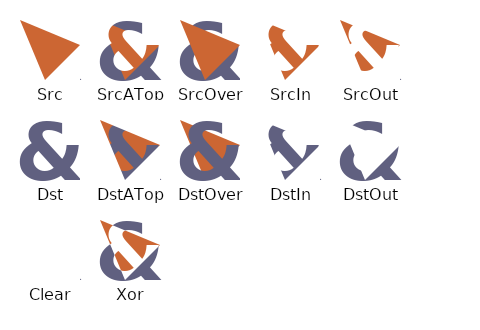
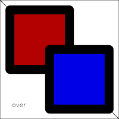
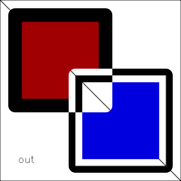

# Compositing Operators in R Graphics

The results of compositing operators vary between different graphics
systems.  The purpose of this document is to record the results
for different systems, including
R graphics devices, so that we can discuss the differences
and try to converge on a set of consistent results.

Functions are provided to generate sets of results.
**Please add images from your graphics device** plus any
comments and observations on any differences and possible
resolutions.

## Porter-Duff compositing operators

The code in [functions.R](functions.R) can be used to generate an array of 
images in R showing the results of group compositing operators,
for the Porter-Duff set of operators.  This code assumes R >= 4.2.0.

```{r}
source("functions.R")
```

### Porter-Duff (1984)

The original 
[Porter & Duff (1984)](https://keithp.com/~keithp/porterduff/p253-porter.pdf) 
might be a reasonable source of ideas (!)
The table below (from the original paper)
shows the intended results of each operator.

In addition to differences in results, we will also have difficulties
with terminology.  For later reference, "A" in this table corresponds
to "source" (or "src") and "B" corresponds to "destination" (or "dst").


### SVG 1.1

This is an official W3C Recommendation:
[Scalable Vector Graphics (SVG) 1.1 (Second Edition)](https://www.w3.org/TR/2011/REC-SVG11-20110816/)

This includes "simple alpha compositing", but Porter-Duff compositing operators
are only possible via 
[filters](https://www.w3.org/TR/2011/REC-SVG11-20110816/filters.html#feCompositeElement). 
The `operator` is limited to the values
"over", "in", "out", "atop", "xor" (and "arithmetic"), though
this covers the interesting cases because you can just swap 
`in` ("src") and `in2` ("dst").  According to the original
Porter-Duff table, "clear" just means not drawing anything, 
"src" means just not drawing "dst", and "dst" means just not drawing "src", 
so maybe you are expected to be able to get these results yourself without
using a filter.

The image below shows the desired result for these operators
with a "reddish" triangle as "src" and a "blueish"
triangle as "dst". It is taken from the 
[W3C Recommendation](https://www.w3.org/TR/2011/REC-SVG11-20110816/filters.html#feCompositeElement). 
SVG allows a variety of results, but the top two rows below show 
a faithful adherence to the Porter-Duff results.
The second row shows the slightly more complex results for semitransparent
rectangles.

The bottom two rows are a bit peculiar and do not correspond to
any other output described in this document (for example, the "xor"
result is particularly bizarre to me).  The comments in the example SVG
code that accompanies this image say that:  'the background 
sometimes shines through and i[n] other cases
is blended into itself (i.e., "double-counting")'


The ["Rendering Model"](https://www.w3.org/TR/SVG11/render.html) states:

3.4 How groups are rendered

Grouping elements such as the ‘g’ element (see container elements) have the
effect of producing a temporary separate canvas initialized to transparent black
onto which child elements are painted. Upon the completion of the group, any
filter effects specified for the group are applied to create a modified
temporary canvas. The modified temporary canvas is composited into the
background, taking into account any group-level masking and opacity settings on
the group.

3.5 How elements are rendered

Individual graphics elements are rendered as if each graphics element
represented its own group; thus, the effect is as if a temporary separate canvas
is created for each graphics element. The element is first painted onto the
temporary canvas (see Painting shapes and text and Painting raster images
below). Then any filter effects specified for the graphics element are applied
to create a modified temporary canvas. The modified temporary canvas is then
composited into the background, taking into account any clipping, masking and
object opacity settings on the graphics element.

The operators are described by [MDN](https://developer.mozilla.org/en-US/docs/Web/SVG/Attribute/operator) as:

over

    This value indicates that the source graphic defined in the in attribute is
    placed over the destination graphic defined in the in2 attribute.

in

    This value indicates that the parts of the source graphic defined in the in
    attribute that overlap the destination graphic defined in the in2 attribute,
    replace the destination graphic.

out

    This value indicates that the parts of the source graphic defined in the in
    attribute that fall outside the destination graphic defined in the in2
    attribute, are displayed.

atop

    This value indicates that the parts of the source graphic defined in the in
    attribute, which overlap the destination graphic defined in the in2
    attribute, replace the destination graphic. The parts of the destination
    graphic that do not overlap with the source graphic stay untouched.

xor

    This value indicates that the non-overlapping regions of the source graphic
    defined in the in attribute and the destination graphic defined in the in2
    attribute are combined.


The code in [svg.R](svg.R) generates a set of SVG files 
(based on a template from Panagiotis Skintzos) that demonstrate
these operators using two filled (but not stroked) rectangles.
The blue rectangle is "src" and the red rectangle is "dst".
The images below are PNG versions (generated using Inkscape) to avoid
any issues with browser incompatibilities.

| op | | op | | op | | op | | op | |
| :--- | :--- | :--- | :--- | :--- | :--- | :--- | :--- | :--- | :--- |
| over |  | in |  | out |  | atop |  | xor |  | 

The images below show the same rectangles, but with semitransparent fills.

| op | | op | | op | | op | | op | |
| :--- | :--- | :--- | :--- | :--- | :--- | :--- | :--- | :--- | :--- |
| over |  | in |  | out |  | atop |  | xor |  | 

### SVG Candidate Recommendations

The images below come from the W3C Candidate Recommendation 
[Compositing and Blending Level 1](https://www.w3.org/TR/2015/CR-compositing-1-20150113/), which is referenced by the W3C Candidate Recommendation
[Scalable Vector Graphics (SVG) 2](https://www.w3.org/TR/2018/CR-SVG2-20181004/).
So these are only "aspirational" images really, but they are a good indication
of what might be a good result.  The "copy" operator corresponds to "source".
The results are again consistent with
the original Porter-Duff results.  

| op | | op | | op | | op | |
| :--- | :--- | :--- | :--- | :--- | :--- | :--- | :--- |
| src over |  | clear |  | copy |  | src in |  |
| src out |  | src atop |  | dst |  | dst over |  |
| dst in |  | dst out |  | dst atop |  | xor |  |

### Cairo Graphics

This section describes the results for the core Cairo PNG device (on
Ubuntu 20.04). This is where the fun starts:

1.  The "clear" operator does NOT clear everything (it only clears the
    "dst" where the "src" overlaps the "dst").

1.  The "source" operator does NOT just draw the "src" (it also still
    draws the "dst" where the "src" does not overlap the "dst").

There are results for both opaque and semitransparent rectangles;
the results are consisten with each other and consistently
differ from the Porter-Duff results.  A diagonal line 
is drawn in the background both cases to show the semitransparency (or
opacity) of the results.  NOTE, for example, that in the "source"
result for semitransparent rectangles, the area of overlap consist of ONLY
the semitransparent "src".  This shows the difference from the 
"over" result.

I am fairly confident that these results are not due to errors in my
implementation because the results correspond to the example images
(and the textual description) from the 
[Cairo graphics documentation](https://www.cairographics.org/operators/).
For example, the description of the "clear" operator says: "Where the second 
object is drawn, the first is completely removed. Anywhere else it is left 
intact."  So the discrepancy between the Cairo results and the Porter-Duff
results is due to Cairo.

The Cairo documentation justifies this behaviour by arguing that
there are "bounded" and "unbounded" interpretations of the "src"
and that Cairo uses a "bounded" interpretation of the "src"
for "clear" and "source" operators
(basically, the compositing occurs using the "src" as a mask
for these operators).
**The possibly good news is that an "unbounded" interpretation,
one that would correspond to the original Porter-Duff results, 
should be easy to implement:  for "clear" just draw nothing 
(neither "src" nor "dst")
and for "source" just draw "src" (do not draw "dst" at all).**
OTOH, this would not work when "src" consists of more than one
shape because then the final result would have to be just
the LAST shape in "src"!

The code to generate the images is shown below, 
but the code is not evaluated (the image resulting from the code
is manually included);  **please follow this pattern
with contributions from your graphics device** so that we can all rebuild
this markdown document on our own machines without having to regenerate the
figures.

```{r eval=FALSE, results="hide"}
png("cairo-pd-simple-solid.png", type="cairo", width=800, height=600)
pdSimpleSolid()
dev.off()
```


```{r eval=FALSE, results="hide"}
png("cairo-pd-simple-trans.png", type="cairo", width=800, height=600)
pdSimpleTrans()
dev.off()
```


### Quartz

These are the results for the (under-development) core Quartz device.
A little more chaos is added to the mix here:

1.  The "clear" and "source" operators operators behave the same
    as for Cairo (which is NOT like the original Porter-Duff).

2.  The "in", "out", "dest.in", and "dest.atop"
    operators include all of the original
    "dst" in the result (again, NOT like the original Porter-Duff,
    but also different from Cairo).

I cannot rule out errors in my implementation in this case.
I am suspicious of the faint line artifacts in several results
(e.g., "dest.in").

The 
[Apple Core Graphics documentation](https://developer.apple.com/documentation/coregraphics/cgblendmode)
describes the "clear" operator, fairly minimally, as "R = 0", where "R"
is the result, which looks a lot like the Porter-Duff definition.
However, it is possible that Quartz is doing something like Cairo
and limiting that result to the region where "src" is drawn.
Unfortunately, I cannot find any nice diagram showing what these
"blend modes" *should* produce.

**The good news again might be that changing "clear" and "source"
would be straightforward.**  Unfortunately, fixing "in", "out",
"dest.in", and "dest.atop"
would be harder, unless it is just a matter of me getting the
intended implementation right.

```{r eval=FALSE, results="hide"}
png("quartz-pd-simple-solid.png", type="quartz", width=800, height=600)
pdSimpleSolid()
dev.off()
```


```{r eval=FALSE, results="hide"}
png("quartz-pd-simple-trans.png", type="quartz", width=800, height=600)
pdSimpleTrans()
dev.off()
```


One [stack overflow thread](https://stackoverflow.com/questions/60785036/quartz-2d-implementing-html5-canvas-globalcompositeoperation)
suggests that Quartz uses the same approach as
[Skia](https://skia.org/docs/user/api/skblendmode_overview/), which says: 
"Draw[ing]
geometry with transparency using Porter_Duff compositing does not combine
transparent source pixels, leaving the destination outside the geometry
untouched."


The [Skia docs](https://skia.org/docs/user/api/skblendmode_overview/) also say:
"Drawing a bitmap with transparency using Porter_Duff compositing is free to
clear the destination."  So the answer might have to be to use off-screen 
bitmaps rather than layers (if Quartz behaves like Skia), EXCEPT that
every shape drawn would have to be a separate bitmap!?




### 'ggiraph'

<p style="background-color:yellow">**Please add**</p>

### 'ragg'

<p style="background-color:yellow">**Please add**</p>

## Stroke and fill

All previous images have just involved filled rectangles with no border.
The examples in this section add a (thick, "stroked") border to each rectangle.
The point of doing this is to explore how different graphics systems
deal with a shape that has both stroke and fill;  **are the stroke
and fill performed as a single operation or are they treated as separate
drawing operations?**

Just to keep a bit of a lid on the chaos, 
the full set of compositing operators are provided, but not shown.
We just concentrate on a couple of representative examples.
For similar reasons, we just focus on opaque fill and stroke.

### Cairo Graphics

The following code generates an example where the result is 
straightforward, but inconclusive: opaque stroke-and-fill "over"
opaque stroke-and-fill.  Where there is overlap,
the "src" stroke-and-fill completely obscure
the "dst" stroke-and-fill.  The result makes sense, but would
occur whether stroke and fill are treated as separate drawing operations
or not.

```{r eval=FALSE, results="hide"}
png("cairo-over-stroke-fill.png", type="cairo", width=200, height=200)
pdStrokeSolid(op="over")
dev.off()
```



The following code generates an example using the "out" operator,
which demonstrates that Cairo
performs stroke and fill as separate drawing operations (not in that
order).  

```{r eval=FALSE, results="hide"}
png("cairo-out-stroke-fill.png", type="cairo", width=200, height=200)
pdStrokeSolid(op="out")
dev.off()
```


This result happens in two stages:  first there is [blue filled rectangle
"out" red stroked-and-filled rectangle], which removes the top-left corner
of the blue fill, as shown below.

```{r eval=FALSE, results="hide"}
png("cairo-out-stroke-fill-part-1.png", type="cairo", width=200, height=200)
pdStrokeSolid(op="out", stroke2=FALSE)
dev.off()
```


The second stage is [stroked rectangle "out" the result above], which 
removes the blue fill (with the top-left corner missing) from the stroke.
Crazy stuff, but it does demonstrate that **Cairo treats stroke and fill
as separate drawing operations.**

The following code produces the full set of images for 
compositing stroked-and-filled rectangles on Cairo;
click [here](cairo-pd-stroke-solid.png) to see them all.
Some results are quite striking, but they are all consistent with 
stroke and fill as separate operations, plus the already-established
(and slightly flawed) behaviour of compositing operators in Cairo.

```{r eval=FALSE, results="hide"}
png("cairo-pd-stroke-solid.png", type="cairo", width=800, height=600)
pdStrokeSolid()
dev.off()
```

The following code produces all operators with opaque fills and 
semitransparent borders; 
click [here](cairo-pd-stroke-trans.png) to see the results.
These are fascinating to look at, but add nothing new.

```{r eval=FALSE, results="hide"}
png("cairo-pd-stroke-trans.png", type="cairo", width=800, height=600)
pdStrokeTrans()
dev.off()
```

### Quartz

Opaque stroke-and-fill "over"
opaque stroke-and-fill produces the same result as Cairo.
Where there is overlap,
the "src" stroke-and-fill completely obscure
the "dst" stroke-and-fill.

```{r eval=FALSE, results="hide"}
png("quartz-over-stroke-fill.png", type="quartz", width=200, height=200)
pdStrokeSolid(op="over")
dev.off()
```


Opaque stroke-and-fill "out" opaque stroke-and-fill produces an even 
crazier result than Cairo's.  However, it is consistent with the other
Quartz behaviour and it does demonstrate that **Quartz also treats
stroke and fill as separate drawing operations.**

```{r eval=FALSE, results="hide"}
png("quartz-out-stroke-fill.png", type="quartz", width=200, height=200)
pdStrokeSolid(op="out")
dev.off()
```



To help with understanding how that result happens, here is the result
of the first
stage, just [blue filled rectangle "out" red stroke-and-filled rectangle].
Compositing the thick stroke with the result below (using the "out"
operator) gives the result above.

```{r eval=FALSE, results="hide"}
png("quartz-out-stroke-fill-part-1.png", type="quartz", width=200, height=200)
pdStrokeSolid(op="out", stroke2=FALSE)
dev.off()
```


The following code produces the full set of images for 
compositing stroked-and-filled rectangles;
click [here](quartz-pd-stroke-solid.png) to see them all.

```{r eval=FALSE, results="hide"}
png("quartz-pd-stroke-solid.png", type="quartz", width=800, height=600)
pdStrokeSolid()
dev.off()
```

The following code produces all operators with opaque fills and 
semitransparent borders; 
click [here](quartz-pd-stroke-trans.png) to see the results.
These are fascinating to look at, but add nothing new.

```{r eval=FALSE, results="hide"}
png("quartz-pd-stroke-trans.png", type="quartz", width=800, height=600)
pdStrokeTrans()
dev.off()
```

### 'ggiraph'

<p style="background-color:yellow">**Please add**</p>

### 'ragg'

<p style="background-color:yellow">**Please add**</p>


## Compositing groups

The original motivation for the set of examples in this section was
to show that
different results can be achieved by nesting groups and combining
different operators.  It may turn out that the results are useful 
for previous sections as well.

The specific example used in this section is stroked-and-filled 
rectangles as "src" and "dst", like the previous section, BUT with the "src"
itself as a group (with the default "over" operator):
[[stroked rectangle "over" blue filled rectangle] &lt;op&gt; red stroked-and-filled rectangle].
In other words, the stroke and fill in the "src" are turned into a single
drawing operation that is combined with "dst".

To keep a lid on the chaos, we will only consider opaque rectangles,
but the results are so well behaved we can show them for all operators again.

### Cairo Graphics

The most important result is that the combined stroke-and-fill produces
a more well-behaved output compared to the previous section.  
For example, the "out" result is just the
blue stroked-and-filled rectangle with its top-left corner missing.
This further demonstrates that Cairo normally treats stroke and
fill as separate drawing operations AND demonstrates that we can treat
them as a single drawing operation by nesting them within a group.

The surprising part is that ALL of the Cairo output is now behaving 
faithfully to the original Porter-Duff definitions.
Specifically, the "clear" result and the "source" result do NOT 
contain the "dst".

**NOTE that the diagonal line in the background
is NOT obscured** so this is NOT just due to something like a default
opaque white canvas within groups.

Unfortunately, I cannot explain this result adequately yet.
It may be that compositing a *group* with previous drawing
is different from compositing a *shape* with previous drawing
because the effective region 
of a Cairo "group" is the full size of the image (even if its
background is fully transparent), whereas the effective region
of a *shape* is just the area where the ink used to draw the shape goes.

```{r eval=FALSE, results="hide"}
png("cairo-pd-group-solid.png", type="cairo", width=800, height=600)
pdGroupSolid()
dev.off()
```


The examples are repeated below with just filled rectangles
in order to aid the comparison with the Porter-Duff (and SVG)
results at the top of this document.

```{r eval=FALSE, results="hide"}
png("cairo-pd-group-fill.png", type="cairo", width=800, height=600)
pdGroupFill()
dev.off()
```


### Quartz

Shockingly, the previously-even-more-bizarre-than-Cairo Quartz
results also now conform to the original Porter-Duff.
As before, we get a nice demonstration of being able to 
group stroke and fill as a single drawing operation.
However, much more striking is the fact that, not only
do "clear" and "source" no longer contain "dst", but 
also "in", "out", "dest.in", and "dest.atop" no longer
contain "dst".

Unfortunately, I cannot explain this result yet either.
Again, it may be due to the difference in compositing 
a Quartz2D "layer" versus compositing Quartz2D shapes?
("geometry" versus "bitmaps" in the Skia terminology mentioned earlier.)

```{r eval=FALSE, results="hide"}
png("quartz-pd-group-solid.png", type="quartz", width=800, height=600)
pdGroupSolid()
dev.off()
```


**NOTE that I am NOT sure that placing an implicit group around
"src" is the right "solution" in general,** especially because it would
actually need to be an implicit group around EVERY shape in "src"!

**Is a possible solution to create an implicit group ("group" in Cairo,
"layer" in Quartz) around every drawing primitive (maybe only
if we are compositing)?** That would probably be incredibly inefficient,
AND it would alter the stroke-and-fill behaviour (unless each stroke
and fill are also implicitly grouped!).

## Proposal

**Can we agree to conform to the original Porter-Duff and the (simple) SVG
operator definitions?**  I think I can get both Cairo and Quartz to
do this.

The output below was generated using the 
[R-defquartz](https://svn.r-project.org/R/branches/R-defquartz/) branch.

### Cairo

Put an implicit group around each shape (when we are defining a group
and the operator is "clear" or "source").
This would need a bit more work to make sure that stroke and fill are
still treated as separate drawing operations.

```{r eval=FALSE, results="hide"}
png("cairo-pd-simple-solid-fix.png", type="cairo", width=800, height=600)
pdSimpleSolid()
dev.off()
```


```{r eval=FALSE, results="hide"}
png("cairo-pd-simple-trans-fix.png", type="cairo", width=800, height=600)
pdSimpleTrans()
dev.off()
```


### Quartz

Put an implicit layer around each shape (when we are defining a group
and the operator is "clear", "source", "in", "out", "dest.in", or "dest.atop").
This would need a bit more work to make sure that stroke and fill are
still treated as separate drawing operations.

```{r eval=FALSE, results="hide"}
png("quartz-pd-simple-solid-fix.png", type="quartz", width=800, height=600)
pdSimpleSolid()
dev.off()
```


```{r eval=FALSE, results="hide"}
png("quartz-pd-simple-trans-fix.png", type="quartz", width=800, height=600)
pdSimpleTrans()
dev.off()
```


